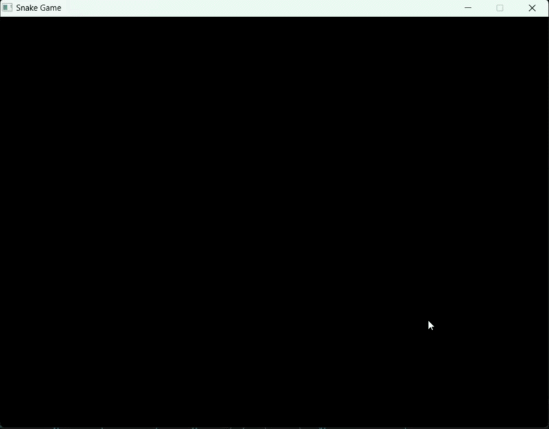

# Snake Game — C++ / SDL2

A terminal-free snake game built in C++ using SDL2. Run it, eat food, don't hit the walls or yourself.



---

## Features

- Smooth movement with arrow key controls
- Snake grows by 5 segments on each food eaten
- Score tracking (score display soon to be added)
- Wall collision detection
- Self collision detection
- Randomly spawned food each round
- 800x600 window, 10px grid

## Controls

| Key | Action |
|-----|--------|
| Arrow Up | Move up |
| Arrow Down | Move down |
| Arrow Left | Move left |
| Arrow Right | Move right |

## Build & Run

**Windows (MinGW)**
```bash
g++ main.cpp Game.cpp Snake.cpp -o snake -IC:/SDL2/include -LC:/SDL2/lib -lSDL2main -lSDL2
./snake
```
`SDL2.dll` is already included — no extra setup needed.

**Linux**
```bash
sudo apt install libsdl2-dev
g++ main.cpp Game.cpp Snake.cpp -o snake $(sdl2-config --cflags --libs)
./snake
```

VS Code users: a build task is set up in `.vscode`, just hit `Ctrl+Shift+B`.

---

## Author

**picodes123** — [github.com/picodes123](https://github.com/picodes123)

## License

This project is open source under the [MIT License](https://opensource.org/licenses/MIT).
